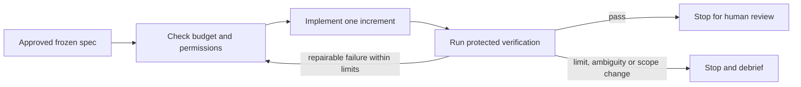
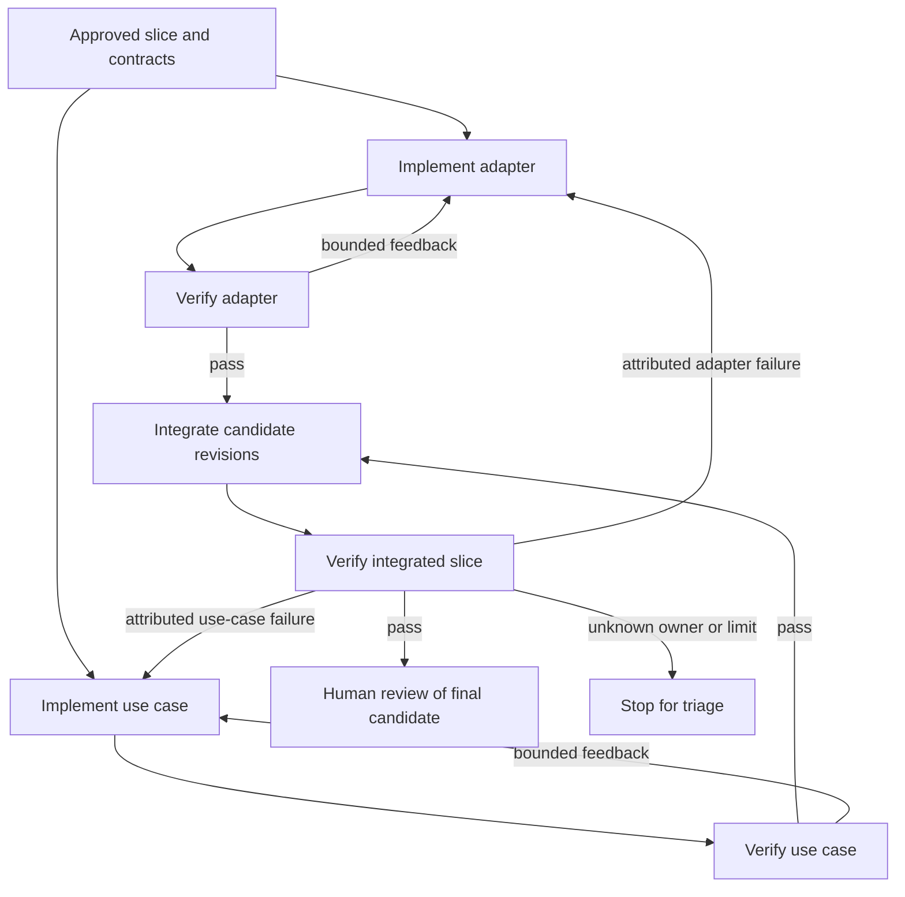

# Proposal: LOOPING and GRAPH LOOPING workflows

Status: **proposed, not adopted**. Target: a later opt-in extension to release 4.6.
Owner: to be assigned at pilot approval. No workflow engine, dashboard, paid API or
additional agent is required by the core methodology. This proposal does not claim an
implemented runner. Graph looping means a dependency graph of tasks with verification
feedback to specific nodes, not a particular framework.

## Problem and intended outcome

A sequential task may need several implementation/verification passes. A larger slice
may need independent modules developed and checked separately, then integrated. A single
unstructured loop repeats too much work and can accidentally reuse evidence from stale
inputs. We want bounded iteration, selective rework and reviewable evidence at each step.

| Mode | Choose when | Avoid when |
|---|---|---|
| One pass | One scoped change and a straightforward verifier | Multiple attempts need controlled recovery |
| LOOPING | One contract-bounded task needs implement/check/fix cycles | Requirements or verifier are unsettled |
| GRAPH LOOPING | Several contract-bounded tasks have dependencies and targeted feedback | Graph administration costs more than the work |

## LOOPING: one bounded work item



The controller owns routing; the worker changes only its allowed files. Check maximum
passes, wall-clock deadline, reserved cost and cancellation before every pass and tool
call. A failed verifier can lead to a fix, never a weaker verifier. If verification itself
is wrong, stop and have the owner approve a new spec/version. Stop after repeated identical
failure signatures without progress (pilot default: two), on scope drift or on an unknown
outcome. Human approval occurs after the loop, before merge; do not create an approval
prompt for each routine authorized retry.

## GRAPH LOOPING: dependency graph plus feedback edges



Solid dependency relationships form a DAG. Feedback edges are separately declared,
bounded transitions; they do not make dependencies circular. Freeze the graph/version
before launch. Reject missing node IDs, dependency cycles, unbounded feedback edges and
unreachable required nodes. A controller may schedule a node only when every required
predecessor has verified evidence for the expected output revision. Nodes can execute in
parallel only when allowed files and side effects are disjoint and review capacity permits.

When upstream output changes, mark its dependent results and approvals **stale**. Re-run
the affected descendants and final integration, preserving unaffected results only when
their input hashes still match. Feedback targeting must use a predefined mapping or human
triage. A model may recommend the owner, but cannot silently reroute to an unapproved node.

Example: if adapter verification catches a malformed-response bug, repeat the adapter
node and its verification; the unchanged independent use-case result may be reused. The
integrated candidate must always be rebuilt/rechecked against both exact output revisions.

## Proposed contract and records

Keep the current loop spec plus a graph declaration for GRAPH LOOPING. This illustrative
contract is not a supported runner configuration and contains no runnable commands:

```yaml
workflow_id: reading-list-slice
spec_version: 1
mode: graph_looping
uc_ids: [UC-01]
limits:
  max_total_node_attempts: 12
  max_wall_minutes: 45
  max_cost_usd: 3
  max_parallel_workers: 2
nodes:
  - id: adapter
    depends_on: []
    contract: module-json-store
    allowed_files: [src/json_store.py, tests/test_json_store.py]
    verifier_ref: protected-adapter-check-v1
    max_attempts: 3
  - id: use_case
    depends_on: []
    contract: module-reading-list
    allowed_files: [src/reading_list.py, tests/test_reading_list.py]
    verifier_ref: protected-use-case-check-v1
    max_attempts: 3
  - id: integration
    depends_on: [adapter, use_case]
    contract: UC-01
    allowed_files: []
    verifier_ref: protected-slice-check-v1
    max_attempts: 3
feedback_edges:
  - from: integration
    to: adapter
    when: adapter_contract_failure
    max_traversals: 2
  - from: integration
    to: use_case
    when: use_case_contract_failure
    max_traversals: 2
on_unknown_failure: stop_for_human
on_success: stop_for_human_review
```

Local repair retries are bounded by node attempts. Feedback traversal invalidates the
source verification and affected descendants and consumes both edge and global budgets.
The most restrictive remaining limit wins; concurrency does not multiply the global cap.
Protected verification may include tests outside worker write scope. Worker-authored tests
can add coverage but cannot replace or weaken the protected acceptance checks.

Each runlog event records run ID, node/pass, attempt, frozen spec hash, input hashes, output
revision, verifier version, result/evidence, time/cost, next transition and reason. Human
review records identify the accepted candidate revision. Credentials and sensitive payloads
are excluded from logs. Preserve previous events; do not rewrite history on retry.

## Proposed state machine and deterministic control

Node states: `pending → ready → running → verified → reviewed`; alternatives are `failed`,
`stale`, `blocked` and `cancelled`. A failed node returns to ready only through an allowed
retry/feedback transition within all limits. An output change moves affected verified or
reviewed nodes to stale. A pass is not a merge, deployment or human approval.

Keep these operations in ordinary code:

- Schema validation, dependency readiness, allowed transitions and red-blocker rules.
- Atomic budget reservation, wall-clock limits, concurrency and review-cap accounting.
- Runtime file/tool/network permissions and protected spec/verifier enforcement.
- Input/output hashes, test exit status, artifact freshness and final integration checks.
- Checkpoint persistence, cancellation propagation and deduplication/idempotency keys.

On restart, reconcile any in-flight action before retrying. Never replay a possibly completed
external effect blindly. Use idempotent actions where possible, otherwise require human
reconciliation or a documented compensating action. Cancellation stops new dispatch and
terminates running workers through the declared kill mechanism; inspect any partial output.
Budget checks must reserve worst-case per-call spend; if the runtime cannot enforce a hard
spend cap, do not advertise it as a guarantee or enable unattended paid execution.

Deterministic control means the same recorded inputs and decisions produce the same
transition. It does not imply a model will regenerate identical output or that a passing
check proves the entire specification. Replay recorded decisions; do not re-query models
and call the result deterministic replay.

## Optional Jev / TypeSafe evaluation

The request named “JEV.ai.” The product evaluated here is **Jev by TypeSafe AI**, using
its official documentation; `jev.ai` could not be verified as its official site.
Research date: 2026-09-19. No account, SDK dependency or live API call is added by this PR.

TypeSafe describes Jev as returning typed answers and probabilities from state and typed
questions. Its documentation explicitly notes that calibration does not guarantee an
individual answer is correct. This supports evaluating a constrained semantic decision
component, not claiming deterministic correctness. [Official System One documentation](https://docs.typesafe.ai/concepts/system-one)

**Proposed division of responsibility:**

| Component | Responsibility | Authority |
|---|---|---|
| Deterministic controller | Validate facts, limits, edges and permissions; dispatch eligible work | Enforce policy |
| Jev, optionally | Recommend a failure category or eligible owner from a closed set | Advisory judgment |
| Coding model/worker | Produce a scoped change | Allowed files only |
| Protected verifier | Evaluate acceptance checks on the revision | Supply check evidence |
| Human | Resolve ambiguity; accept revisions and release decisions | Review and authorize |

A useful first pilot is failure triage: `adapter_contract_failure`, `use_case_contract_failure`,
`environment_failure`, or `unknown`. Filter the candidate owners through deterministic
eligibility checks first. Keep `unknown` available. If Jev's response is late, unavailable,
malformed, below a calibrated threshold, inconsistent with evidence, or proposes an
ineligible owner, stop or use the existing manual triage path. Never use Jev to override
failed tests, grant permissions, raise budgets, rewrite graph edges or declare human review.

Use a narrow adapter that accepts redacted task state and returns a versioned recommendation
with available probability/confidence metadata, request ID, model version, latency and cost.
Do not assume every primitive has the same response fields: the official introduction
lists Choice/Score confidence separately from Noul's probability output. [Official primitives overview](https://docs.typesafe.ai/introduction)

This is an integration proposal, not an assertion that Jev supplies a durable graph engine,
scheduler, sandbox or deterministic replay. The controller must provide those properties.
Pin a supported model version for an experiment, record prompt/schema versions and retain
responses needed for audit. Treat SDK and API details as implementation-time choices.

## Pilot and adoption criteria

1. Establish a manual/one-pass baseline on representative bounded tasks, including known
   failures. Predeclare the sample, quality targets, allowable false-routing rate, time and
   cost budget. Include ambiguous and out-of-scope cases, not only happy paths.
2. Pilot LOOPING with one task and no external side effects. Test success, repeated failure,
   budget exhaustion, timeout, verifier tampering, cancellation and restart.
3. Pilot GRAPH LOOPING with two independent modules and integration. Demonstrate stale-result
   invalidation, selective retries, cycle rejection, safe concurrency, cancellation and
   crash recovery without duplicate effects. Confirm global limits hold across parallel nodes.
4. Evaluate Jev in shadow mode against labeled human triage and a rules-only baseline.
   Measure wrong routing, abstention, calibration by confidence bucket, end-to-end cost,
   latency, rework and review time. A model confidence number is not an observed accuracy rate.
5. Promote one optional workflow at a time only after the owner reviews evidence. Required
   invariants: no red bypass, no out-of-scope writes/effects, no stale acceptance, no limit
   overrun, and no duplicate effect in the test scenarios. Revert to the simpler workflow
   if quality degrades or coordination/review cost outweighs benefit.

Report findings in a real retrospective and the [evidence ledger](../EVIDENCE.md).
Acceptance of this proposal later requires a separate implementation PR with executable
state-transition and failure-injection tests. Core Slim projects remain valid without loops.
